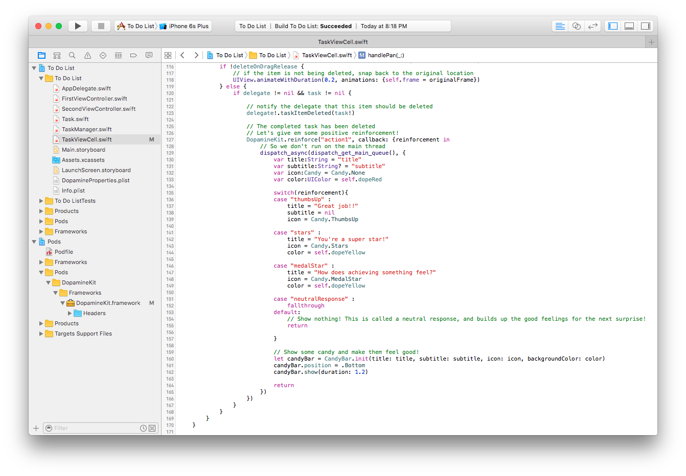

# DopamineKit Example App
## "To Do List" app

Contained is a simple "To Do List" app that demonstrates how DopamineKit may be used in your code.

After downloading the project files, open "__To Do List.xcworkspace__" with Xcode. Run a simulation and play around with it, and then pay attention to the TaskViewCell module.

### Importing DopamineKit
The project uses the [CocoaPod](https://cocoapods.org/) named 'DopamineKit'. Look at the [Podfile](To Do List/Podfile) in the project. [Here](https://github.com/DopamineLabs/DopamineKit-iOS-binary/) are instructions to import the framework.

### Actions that represent Habits

When choosing an action to reinforce, choose one that would create a positive habit for the user. In a To List app, completing tasks is a key result of productivity so we will reinforce this. 

### Responding to an Action
Once a task is completed by the user, the user will delete the task from the list by swiping it away. When this happens, `DopamineKit.reinforce()` is called. 

 - __Note:__ The chosen form of reinforcement in this example app is using a `CandyBar` from DopamineKit. Developers should use visual reinforcement that meshes well with their UX, and the `CandyBar` is shown as a general solution.

There are 4 possible paths, shown by the `switch` statement, that can be taken based on the resulting `reinforcement` string. 

3 out of the 4 paths were chosen by the app developer on the [Dopamine Developer Dashboard](http://dashboard.usedopamine.com), and the last 1 is a "neutralResponse" which purposefully does not show anything to maintain a certain surprise factor. 
