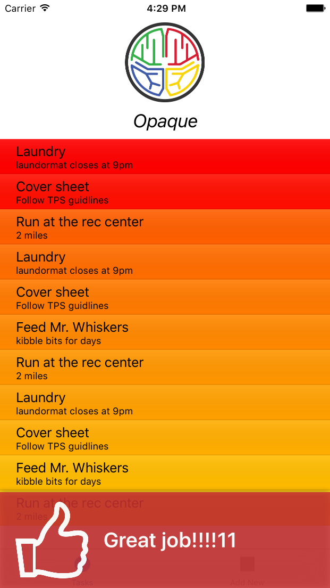

# DopamineKit Example App

Contained is a simple "To Do List" app that demonstrates how DopamineKit may be used in your code.

## "To Do List" app

After downloading the project files, open "__To Do List.xcworkspace__" with Xcode. Run a simulation and play around with it, and then pay attention to the _`TaskViewCell.swift`_ module.

### Importing DopamineKit
The project uses a [CocoaPod](https://cocoapods.org/) named 'DopamineKit'. Look at file [To Do List/Podfile](To Do List/Podfile) in the project. Here is a guide for [importing DopamineKit into your own project](https://github.com/DopamineLabs/DopamineKit-iOS-binary/).

### Actions that represent Habits

Reinforce your apps ​_essential_​ actions; what users come to your app to do. Three actions is definitely enough; one is often best. 

Our "To Do List" app ​_exists_​ to help uses be more productive by completing items on their list. So we will reinforce that. 

### Responding to an Action
When the user completes a task, they will swipe it off of their check-list. When this happens, `DopamineKit.reinforce()` is called. 

 - __Note:__ The chosen form of reinforcement in this example app is using a `CandyBar` from DopamineKit. Developers should use visual reinforcement that meshes well with their UX, and the `CandyBar` is shown as a general solution.

There are 4 possible paths, shown by the `switch` statement, that can be taken based on the resulting `reinforcement` string. 

3 out of the 4 paths were chosen by the app developer on the [Dopamine Developer Dashboard](http://dashboard.usedopamine.com).

The default case, or “neutral response", no reward will be delivered. This builds anticipation for the next surprising reward.